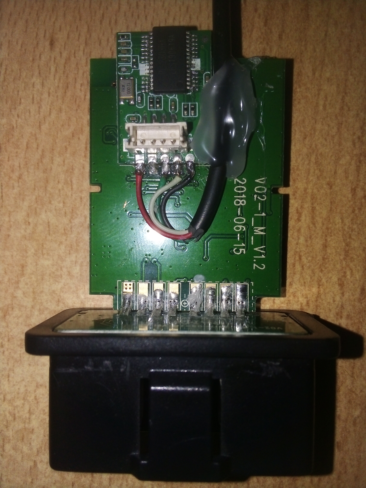
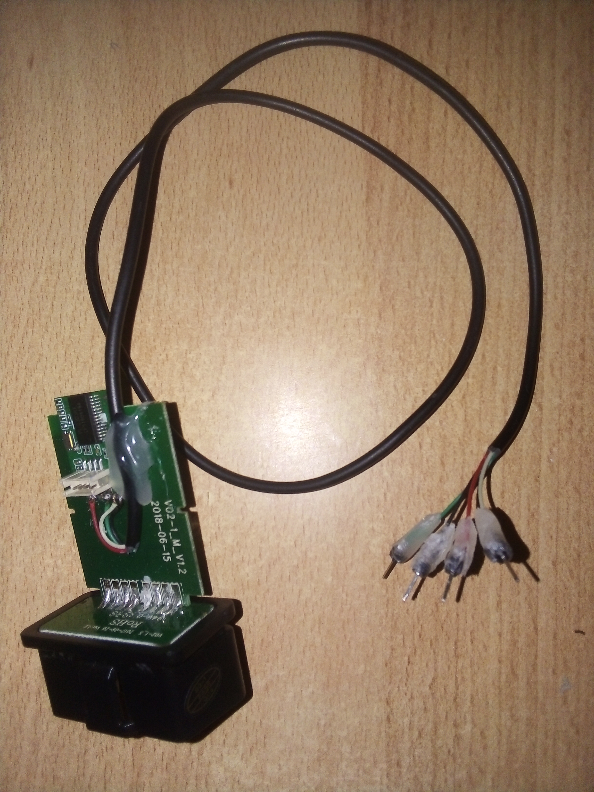

# Talk to your OBD-II device with any MCU via the serial port

## Description:

This sketch was written to communicate with an ELM327 device with the OBDII protocol via the serial port.

The only ELM327 device I was able to put my hands on was a USB one, which introduced a problem, I wasn't realisticly going to reverse engineer a USB driver just to retreive some data for fun, so as you can see in the picture below, I had to de some light researching on the parts used in order to understand how data is transmitted (went the hardware reverse engineering path) and what I found out was:

- ELM327 devices communicate using RS232 (Serial), and they're basically an OBD to RS232 interpreter (like literally what's written in the [ELM327 datasheet](https://www.elmelectronics.com/wp-content/uploads/2016/07/ELM327DS.pdf)).

- ELM327 devices talk in 3.3V logic level but since mine was USB compatible, it had a 5V to 3.3V converter onboard.

- The ELM327 datasheet is a light (97 pages) read which is very simple to understand

- The OBDII is ISO, which meant that my software was going to be compatible with all ELM327 devices (and most clones), in fact you can read all about it in this [wikipedia article](https://en.wikipedia.org/wiki/OBD-II_PIDs)

- There were better libraries written by people who are smarter and more experienced than me, but it's okay, we're here to learn.

[Example: arduino-OBD2](https://github.com/sandeepmistry/arduino-OBD2)

>Where communication was achieved.

## How to use:

As you can see in the picture below, after finding the serial port in the device, I soldered a couple of wires to it (note that these wires carry a 5V logic level! it's okay to directly wire them to an Arduino Uno or Nano but no ESP32! in that case you'll need a logic level converter) and then got the sketch ready.

So simply, connect your device to the serial port on your MCU (hardware or software serial, doesn't matter), open the serial monitor and enjoy.

The code is, in my opinion, well commented, so hopefully you'll understand it just by reading it.
